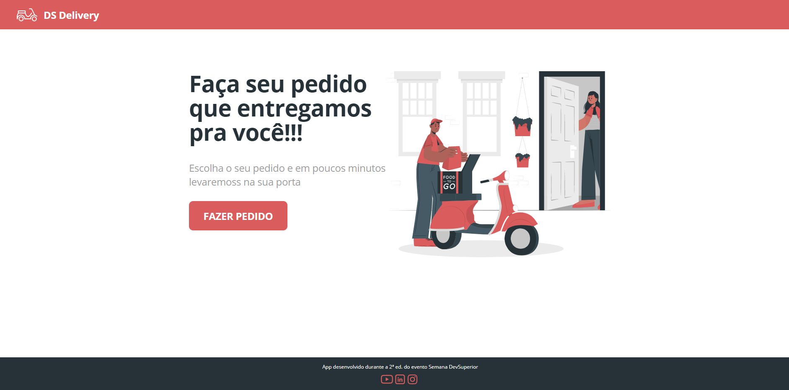

# ➤ Front-end Web Ds Delivery

A implantação do front-end web foi feita na Netlify e o sistema pode ser visto aqui: https://my-dsdelivery.netlify.app/

### ➤ Imagens do Sistema

#### Home

#### Realizar Pedidos

**Atenção**: 
- Para subir a aplicação localmente é necessário ter o `Node` instalado.

- Antes de inicializar a aplicação é necessário gerar um arquivo `.env` na raiz do projeto para configuração de variáveis de ambiente. Verifique o arquivo `.env_example` para servir de base. 

- É necessário ter uma conta no Map Box (mapa utilizado para localização). Após a geração do token de acesso no site do Map Box, coloque o valor em **REACT_APP_ACCESS_TOKEN_MAP_BOX** (arquivo `.env`).

- Para uma melhor experiência de utilização é necessário que a instância do back-end esteja no ar. Coloque em **REACT_APP_API_URL** (arquivo `.env`) a URL local do back-end.

- Execute o comando `npm i` para baixar as dependências.

Feitos os passos acima, execute `npm start`. Neste ponto, sua aplicação deverá estar rodando em `http://localhost:3000`.

## ➤ Rotas

### Home ( / ) 
- Responsável pela página principal do sistema.

### Orders ( /orders )
- Responsável por listar todos os produtos disponíveis, bem como renderização do mapa e finalização do pedido. 

## ➤ Tecnologias
1. Typescript 4.1.3
2. ReactJS 17.0.1
3. React Toastify 6.2.0
4. React Leaflet 3.0.5
5. Axios 0.21.1

## ➤ Map box
Link para mais informações sobre o Map box: https://www.mapbox.com/